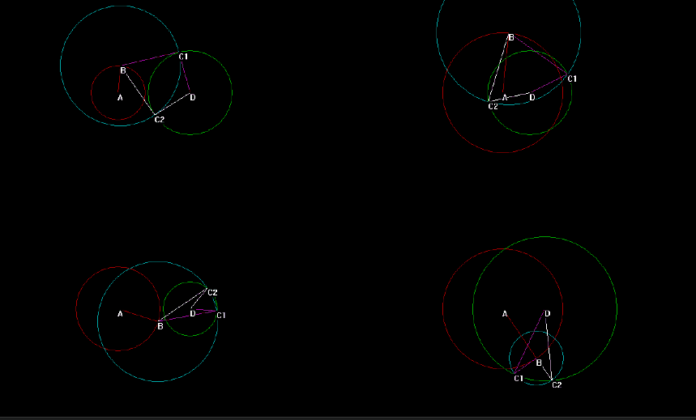
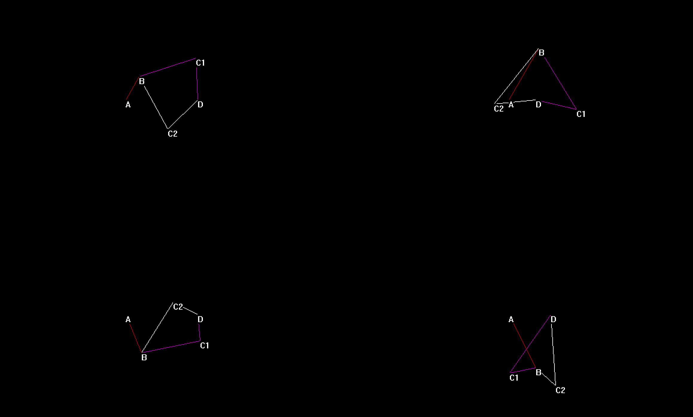
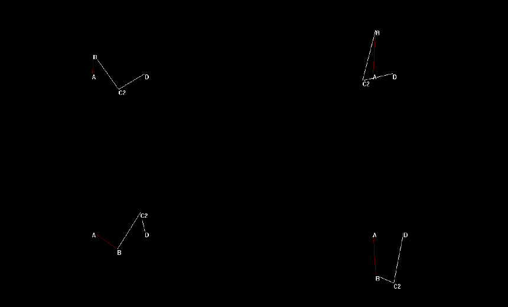

### 四杆机构-机械原理

四杆机构模拟。

四杆机构介绍：[维基百科](https://en.wikipedia.org/wiki/Four-bar_linkage)、[哈工大机械原理课件](https://max.book118.com/html/2018/0418/162009299.shtm).

#### 说明

`AB` 作为主动件，`AD` 为机架。

根据传入的杆长自动绘制出相应的四杆机构。

如下图，程序绘制了曲柄摇杆、双摇杆、摇杆曲柄、双摇杆机构。

单击鼠标右键循环隐藏圆圈、`C2` 点、`C1` 点。

